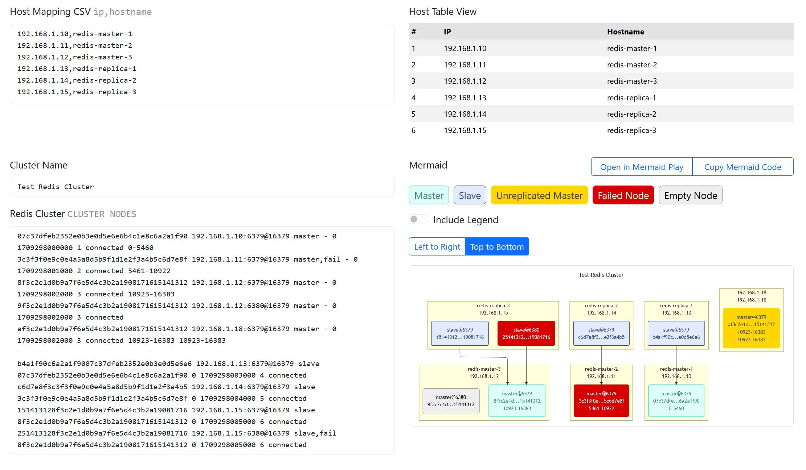

I kept running into the same headache whenever expanding a Redis cluster — figuring out which
replica belonged to which master. The most frustrating part was that cluster configuration relied
entirely on IP addresses (prior to Redis 7.0), making it hard to quickly understand the
topology.

To solve this, I built a browser-based tool that maps masters and replicas, shows where they
reside,
and tracks their status in real time. The tool generates the cluster topology as a Mermaid
flowchart, which can be visualized in any Mermaid renderer such as
[Mermaid Live](https://mermaid.ai/live).

It runs completely in the browser and does not send any data to external servers.

